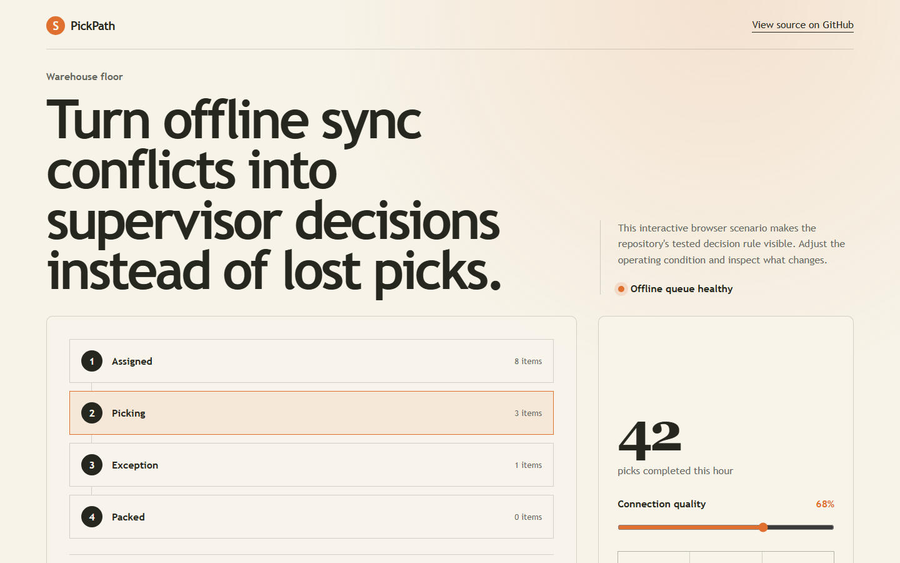
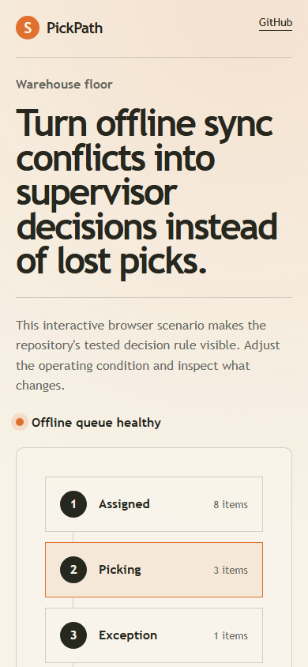

# pickpath

> An offline-first warehouse picking PWA where sync conflicts become supervisor exceptions instead of silently lost picks.

## Live deployment

[](https://github.com/SlateGitOrg/pickpath/actions/workflows/ci.yml)

[Open the interactive PickPath demo](https://slategitorg.github.io/pickpath/)

The deployed interface uses a deterministic offline scenario to make the repository's tested decision rule visible without external services or private data.

### Desktop



### Mobile



`FLAGSHIP` · **Full Stack Engineering** · Advanced · ~4-5 weeks · Logistics / 3PL warehousing

**Primary language:** TypeScript
**Tags:** `offline-first`, `pwa`, `indexeddb`, `conflict-resolution`, `event-driven`, `logistics`

---

## The problem

Warehouse aisles are Wi-Fi dead zones. Pickers scan items offline for twenty minutes and then reconnect. If two pickers both claimed the last unit of an SKU, naive sync silently overwrites one of them - producing a short ship that the customer discovers instead of the warehouse. The loss is invisible in every metric the warehouse tracks until a chargeback arrives.

## ⭐ The differentiator

Conflict resolution is **server-side inventory reservation with compensating actions**, not last-write-wins and not a CRDT merge. Reservations are issued when a pick list is assigned; on reconnect the server validates each offline action against the reservation ledger and emits an explicit **exception task** for genuine conflicts rather than picking a winner. A generic offline app adopts a sync library's default LWW, loses one of the two picks, and leaves no trace that it happened.

This is the sentence to lead with when someone asks you to walk through the
project. Everything else in this repo exists to make it true and to prove it.

## Data

A documented synthetic generator: 12,000 SKUs, a rack topology graph, 200 concurrent pickers, and scripted network partitions of 5-40 minutes - including a known set of **deliberately induced double-picks** so that silent-loss count is a measured zero rather than an assumption.

> No paid API key is required to run or demo this project. Where a paid
> service would add value it is wired as an optional enhancement behind an
> interface with an offline mock as the default implementation.

## Stack

- TypeScript, React PWA with Service Worker + IndexedDB
- Node API, PostgreSQL reservation ledger
- A shared sync-protocol package with versioned action envelopes
- Docker Compose, Vitest, deterministic partition simulator

## Core capabilities

- Durable offline action queue with a monotonic client sequence, replayed in order on reconnect
- Reservation ledger as the sole authority on stock; sync *validates* rather than merges
- Exception queue surfacing unresolvable conflicts to a supervisor with full context and both pickers' actions
- Pick-path ordering over the rack graph (nearest-neighbour under aisle traversal constraints)
- Barcode scanning via device camera with an offline-capable keypad fallback

## Repository layout

```
apps/pwa/                 # React + service worker + IndexedDB queue
apps/api/                 # reservation ledger, sync endpoint
packages/sync-protocol/   # action envelopes, versioning, ordering rules
sim/network-partition/    # deterministic partition + double-pick injection
test/conflict/
```

## Build plan

1. Design the action envelope and the reservation ledger schema together. They are one decision.
2. Build the partition simulator early - you cannot develop this feature by unplugging your laptop.
3. Implement validate-not-merge sync, then the exception queue.
4. Pick-path optimisation last. It is the most fun and the least important.

## Testing strategy

A deterministic partition simulation asserts that **every induced double-pick produces exactly one exception task and zero silent losses**. Replay tests assert that applying the same offline queue twice is idempotent. Ordering tests assert that actions taken offline apply in client sequence order regardless of arrival order at the server.

Tests assert **correctness**, not merely that the code runs. A green suite on
this repo is a claim about behaviour under adversarial conditions; treat any
test that would pass against a deliberately broken implementation as a bug in
the test.

## Quality & safety layer

The system never resolves a genuine stock conflict on its own. Ambiguity escalates to a human with both actions visible - the correct behaviour when the cost of a wrong automatic answer is a customer-visible short ship.

## Measurable outcome

> Zero silently-lost picks across 500 simulated partitions; every genuine conflict surfaces as an actionable exception within 3 s of reconnect.

State it in these terms — business units, not technical ones — in your CV
bullet and in the first thirty seconds of describing the project.

## Interview questions this project answers

- **When is last-write-wins acceptable and when is it negligent?**
- **Why not CRDTs here?**
- **How do you make a sync endpoint idempotent under retry?**

## What this deliberately is *not*

- Not a full WMS. It models the offline-sync correctness problem and leaves the rest stubbed.
- Not a CRDT demonstration - the point is that CRDTs are the wrong tool when the invariant is a scarce resource.


## Run it now

```bash
npm test        # runs the suite; no install step needed
npm run demo    # the 60-second artefact
```

Requires Node 22.6+ (24 recommended). TypeScript runs natively via
type stripping - there is no build step and no `node_modules`.

## Getting started

```bash
git clone <your-fork-url> pickpath
cd pickpath
docker compose up -d
npm install
npm run sim:seed              # SKUs, racks, pickers
npm run test:conflict         # 500 partitions, assert zero silent loss
npm run dev                   # PWA on http://localhost:5173
```

Docker is supported but optional — every path above works on a plain
Windows/macOS/Linux laptop without a cloud account.

## Definition of done

- [ ] The differentiator above is implemented, and a test proves it
- [ ] The measurable outcome is produced by a command anyone can run
- [ ] `README` explains the one decision a generic version gets wrong
- [ ] CI runs the full suite on every push and is green on `main`
- [ ] A recruiter can see the headline artefact in under 60 seconds

## Licence

MIT — see [LICENSE](LICENSE).
